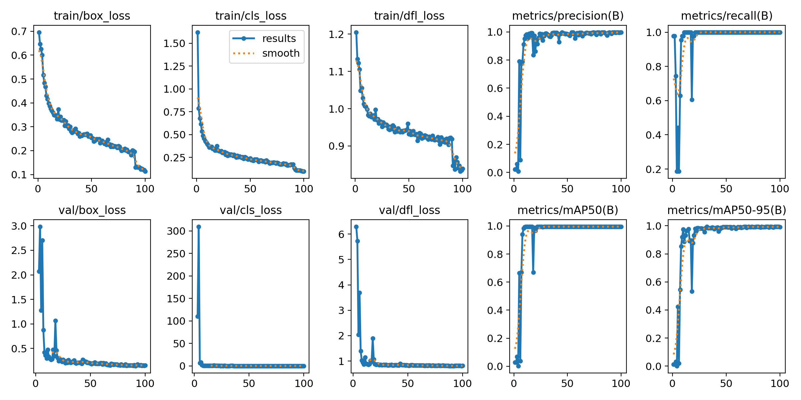
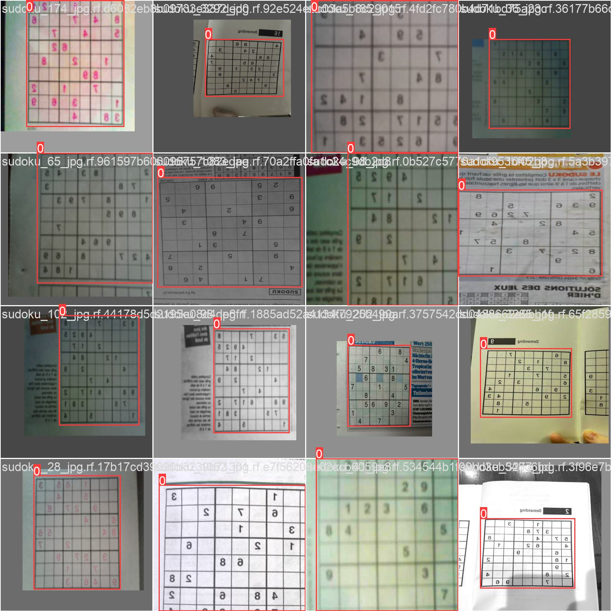

# VisionSudoku

Welcome to the first step of VisionSudoku!

## Overview

In this step we will train a Yolov8 model to detect Sudoku grids in images.
I used a custom dataset from Roboflow  (https://universe.roboflow.com/pete-mksb1/sudoku-vision) for training and evaluation.
You might want to add some extra photos of your own to improve the detection accuracy (i got decent results from just 100 epochs on that dataset).

## Training Metrics

The training metrics curves provide insights into the model's performance during training, including loss curves, precision, and recall.

## Evaluation Sample

The above image represents a sample evaluation, highlighting the model's ability to detect Sudoku grids in diverse scenarios.

## Getting Started

follow the full tutorial : 

## Contributing

any contributions are welcome, open a pr or email me with any suggestions.

## Acknowledgments

- Special thanks to Ultralytics for the powerful YOLOv8 framework.

Happy Sudoku solving with VisionSudoku!

